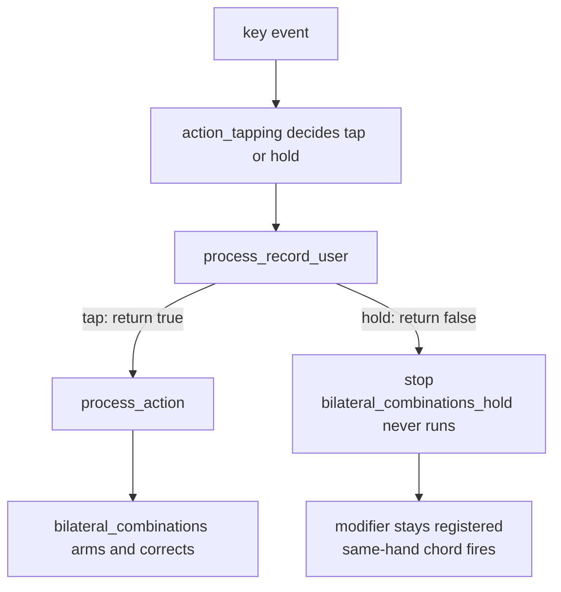

# Same-hand rollover on home row mods

Investigated with claude-code. To pick this up:

```
cd /Users/nivgs/personal/bgkeeb && claude --resume "0615f693-32e9-46f7-a6c6-43f63d76129e"
```

## Problem

`BILATERAL_COMBINATIONS` was enabled, but same-hand rollover still produced
accidental Cmd and Ctrl chords. Holding a home row mod past `TAPPING_TERM` and
then pressing another key on the same hand fired the modifier instead of typing
the letter.

Shift, Alt, Hyper, LCAG and AltGr were already correct. Only Cmd and Ctrl leaked.

## Root cause

`process_record_user` intercepted the GUI and Ctrl mod-taps to swap them for
macOS, and returned `false` on hold. That skips `process_record_handler`, so
`process_action` never ran, so `bilateral_combinations_hold()` never armed.

The tap path returned `true`, so those keys could clear the bilateral state but
never set it.



## Fix

Replaced the hand-rolled swap with QMK's built-in `swap_lctl_lgui`. It is applied
by `mod_config()` during action lookup (`quantum/keymap_common.c:130`), before
`process_action`, so mod-taps stay ordinary mod-taps and bilateral combinations
sees the correct physical modifier.

| File | Change |
| --- | --- |
| `users/manna-harbour_miryoku/manna-harbour_miryoku.c` | Added `apply_os_state()`, which sets `keymap_config.swap_lctl_lgui` from `user_config.is_mac_os` and persists it. Called from `keyboard_post_init_user` and `toggle_os_state`. |
| `users/manna-harbour_miryoku/manna-harbour_miryoku.c` | Removed `handle_mac_os_modifiers()` and the `LGUI_T` / `LCTL_T` / `KC_LGUI` / `KC_LCTL` cases in `process_record_user`. |
| `quantum/keycode_config.c` | Fixed `mod_config()` so the Ctrl and GUI swap works on multi-mod keycodes. |

`user_config.is_mac_os` stays, because `encoder_update_user` needs it to pick
between `A(KC_RGHT)` and `C(KC_RGHT)`. It is now the single source of truth, and
`swap_lctl_lgui` is derived from it.

## Follow-up bug in mod_config

Enabling the built-in swap broke `HYPR_T(KC_G)`, `HYPR_T(KC_M)`, `LCAG_T(KC_D)`
and `LCAG_T(KC_H)`. They lost their GUI bit, which broke the Raycast window
management and app switching shortcuts.

`mod_config()` compared a whole mod value against a mask, which is only correct
when exactly one of bits 0 to 3 is set. Multi-mod keycodes aliased into the GUI
branch:

| Keycode | mods in | Old result | New result |
| --- | --- | --- | --- |
| `LCTL_T` | `0x01` | `0x08` Gui | `0x08` Gui |
| `LGUI_T` | `0x08` | `0x01` Ctrl | `0x01` Ctrl |
| `LSFT_T` | `0x02` | `0x02` | `0x02` |
| `LALT_T` | `0x04` | `0x04` | `0x04` |
| `ALGR_T` | `0x14` | `0x14` | `0x14` |
| `HYPR_T` | `0x0F` | `0x07`, Gui lost | `0x0F` |
| `LCAG_T` | `0x0D` | `0x05`, Gui lost | `0x0D` |

The fix swaps the two bits on their own and leaves every other mod alone. A
correct swap is a no-op for Hyper and LCAG, because both already hold Ctrl and
GUI.

The `swap_lalt_lgui`, `swap_ralt_rgui` and `swap_rctl_rgui` branches have the
same latent bug. They are unused here, so they were left alone.

## Notes

- Plain `KC_LGUI` and `KC_LCTL` on the NAV, MOUSE, NUM, SYM and FUN layers go
  through `keycode_config()`, which handles single keycodes correctly. No change
  needed there.
- Layer-taps are untouched by design. `bilateral_combinations_hold()` is only
  wired into the `MODS_TAP` branch, so same-hand layer chords such as reaching
  F14 on the SYM layer keep working.
- `BILATERAL_COMBINATIONS` is defined with no value, so `#if (BILATERAL_COMBINATIONS + 0)`
  is false and the timeout is compiled out. Same-hand chords are corrected at any
  hold duration. Give the macro a number, for example `300`, to allow deliberate
  same-hand chords after that many milliseconds.
- Chordal Hold is not a drop-in replacement. It has no effect after the tapping
  term expires, so it would not cover the case reported here. It also needs a
  rebase onto a much newer QMK.
- `KC_F14` still reaches the host on release, because its `case` only returns
  `false` inside `if (record->event.pressed)`. Pre-existing behaviour.

## Build

Firmware size after the fix: 25870 / 28672 bytes, 90 percent used.

See `qmk-env.sh` at the repository root for the toolchain setup.
